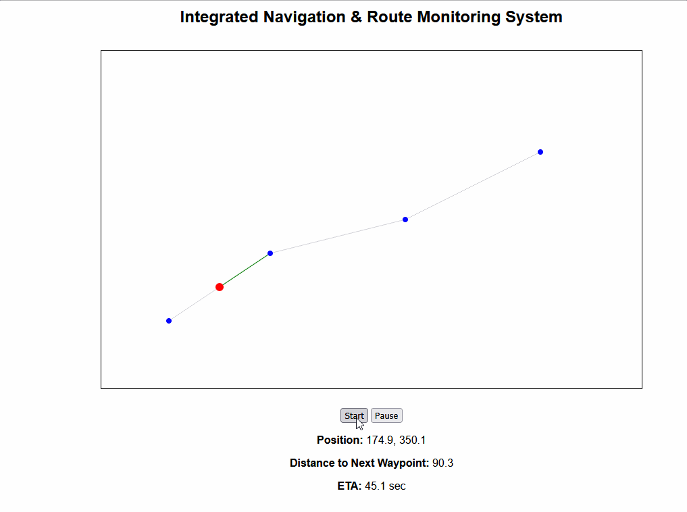

# Integrated Navigation & Route Monitoring System

## Overview
This project implements a simple desktop-based navigation system that
simulates vessel movement along a predefined route.

The application displays a 2D chart view with route waypoints and shows
the vessel progressing along the route in real time.

## Features
- 2D navigation display
- Route visualization using waypoints
- Simulated vessel movement
- Start and pause controls
- Real-time navigation information

## Technology Stack
- HTML
- CSS
- JavaScript

## How to Run
1. Open `index.html` in any modern web browser
2. Click **Start** to begin vessel simulation
3. Click **Pause** to stop the simulation

## Sample Output

